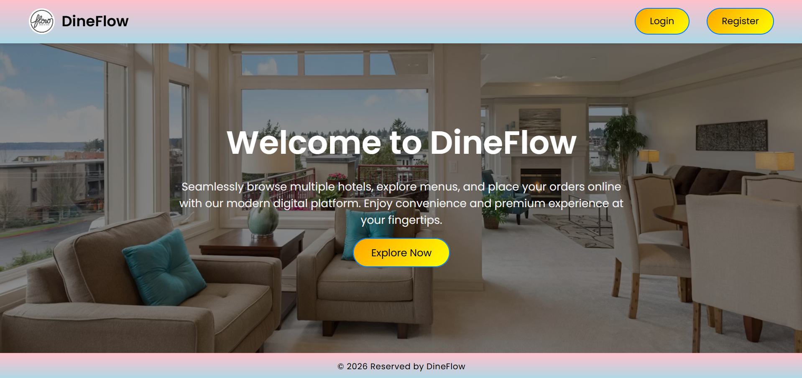
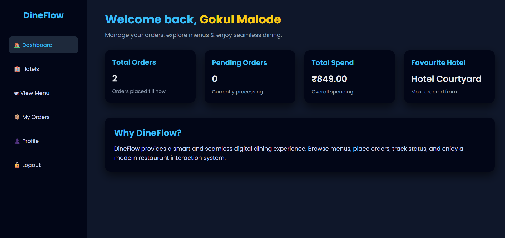
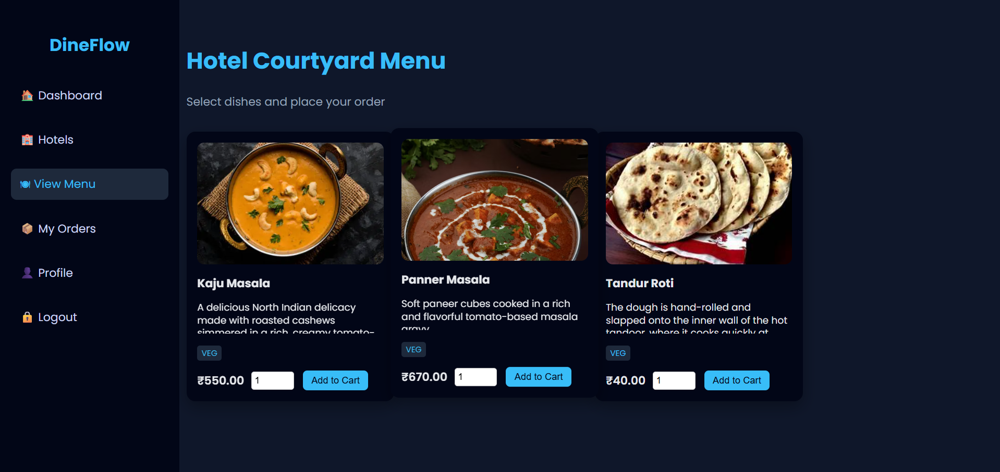
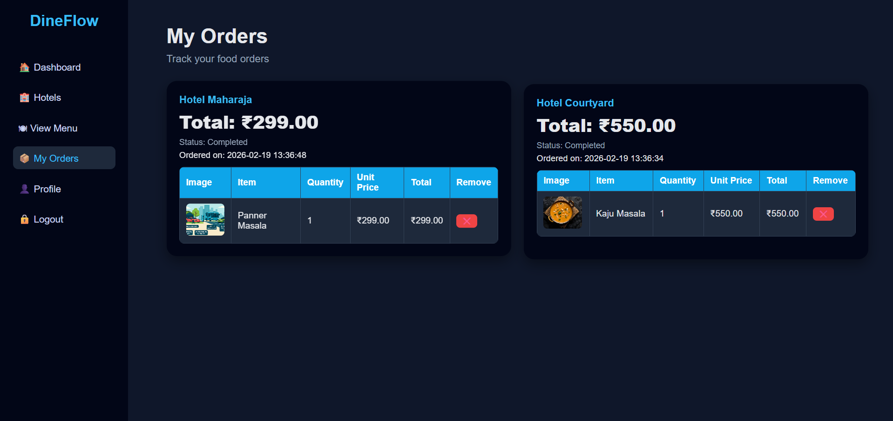
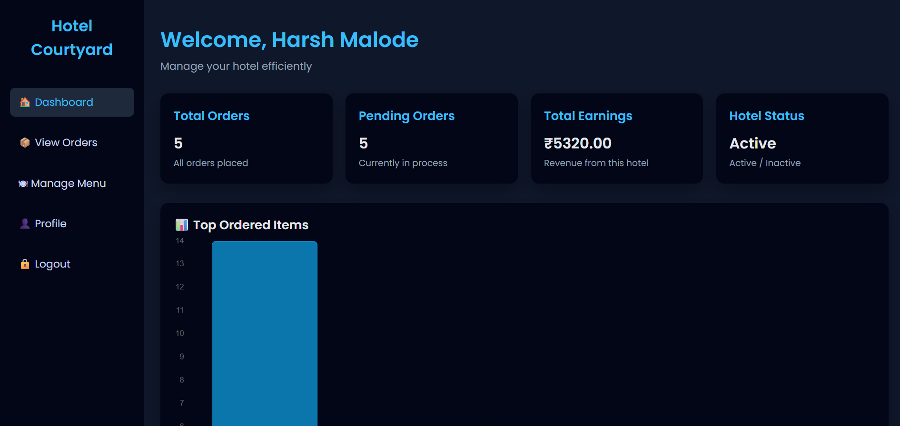
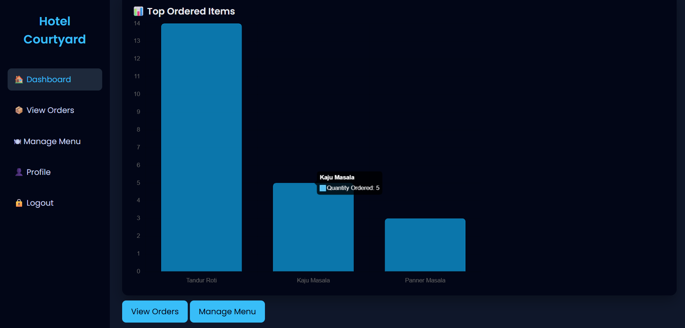
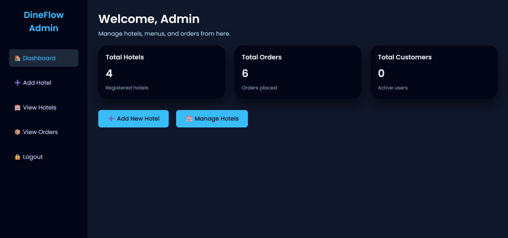
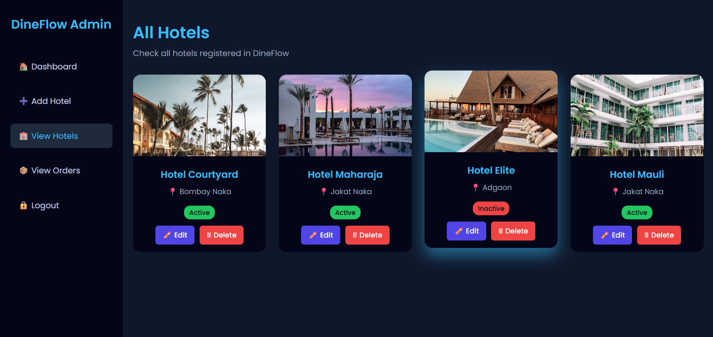

<div align="center">

# 🍽️ DineFlow


### Transforming Dining Experiences Through Digital Innovation
</div>

A complete restaurant management platform that helps administrators, restaurant managers, and customers manage restaurants, menus, food orders, billing, and analytics through a single web application.

🌐 **Live Demo:** Coming Soon

💻 **GitHub Repository:** https://github.com/harshwardhan951/dineflow


---

# 📸 Dashboard Preview



---

# 🔥 Why DineFlow?

Managing restaurants manually becomes difficult as customer orders, menus, and daily operations continue to grow.

DineFlow simplifies restaurant management by providing a centralized system where each user has dedicated responsibilities based on their role.

The platform helps restaurants improve efficiency while giving customers a smooth food ordering experience.

### With DineFlow you can:

✅ Manage multiple restaurants

✅ Digital menu management

✅ Customer food ordering

✅ Real-time order tracking

✅ Restaurant billing

✅ Restaurant analytics

✅ Role-based access control

---

# ✨ Features

## 👤 Customer Module

Customers can:

- Register and Login
- Browse available restaurants
- View restaurant menus
- Place food orders
- Track order status
- View billing details
- View previous orders
- Update profile information

---

## 👨‍💼 Restaurant Manager Module

Managers can:

- Secure Login
- Manage restaurant information
- Add, update, and delete menu items
- Manage food categories
- View customer orders
- Update order status
- Monitor restaurant performance
- View graphical analytics
- Identify the most ordered dishes

---

## 👨‍💻 Administrator Module

Administrators can:

- Register restaurants
- Create manager accounts
- Activate or deactivate restaurants
- Monitor customer orders
- View overall billing
- Manage restaurant availability
- Control the complete platform

> Restaurants become visible to customers only after they are approved by the administrator.

---

# 📊 Analytics

DineFlow includes interactive graphical reports that help restaurant managers understand business performance.

Available analytics include:

- Most Ordered Food Items
- Restaurant Performance
- Order Statistics
- Sales Overview

---

# 🛡 Security

DineFlow follows secure development practices including:

- Role-Based Authentication
- Secure Login System
- Session Management
- Protected Dashboards
- Input Validation
- Database Security

---

# 🛠️ Technologies Used

### Frontend

- HTML5
- CSS3
- JavaScript

### Backend

- PHP

### Database

- MySQL

### Development Tools

- Visual Studio Code
- XAMPP
- Git
- GitHub

---

# 🧩 Project Structure

```text
DineFlow/
├── admin/
├── hotel_manager/
├── customer/
├── assets/
├── uploads/
├── database/
├── screenshots/
├── index.php
├── login.php
├── register.php
└── README.md
```

---

# 📸 Screenshots

| Home | Customer Dashboard |
|------|--------------------|
|  |  |

| Restaurant Menu | Billing |
|-----------------|---------|
|  |  |

| Manager Dashboard | Analytics |
|-------------------|-----------|
|  |  |

| Admin Dashboard | Restaurant Management |
|-----------------|-----------------------|
|  |  |

---

# 🌟 Use Cases

- Restaurant Management
- Online Food Ordering
- Customer Order Tracking
- Restaurant Billing
- Menu Management
- Business Analytics
- Restaurant Performance Monitoring
- Multi-Restaurant Administration

---

# 🚀 Installation

Clone the repository

```bash
git clone https://github.com/harshwardhan951/dineflow.git
```

- Move the project into your XAMPP `htdocs` folder.

- Import the provided SQL database into MySQL.

- Start Apache and MySQL from XAMPP.

- Open the project in your browser:

```text
http://localhost/dineflow
```

---

# 🚧 Future Enhancements

- Online Payment Gateway
- QR Code Ordering
- AI-Based Food Recommendation
- Inventory Management
- Email Notifications
- Customer Reviews & Ratings
- Loyalty Rewards
- Mobile Application

---

# 🤝 Contributing

Contributions are welcome!

If you have ideas to improve DineFlow, feel free to:

- Fork the repository
- Create a new branch
- Commit your changes
- Submit a Pull Request 🚀

---

# 📄 License

This project is licensed under the **MIT License**.

---

# 📬 Contact

### 👨‍💻 Developed by - **Harshwardhan Malode**

📧 Email: harshwardhanmalode798@gmail.com

🔗 LinkedIn: https://www.linkedin.com/in/harshwardhan-malode-226900386

🐙 GitHub: https://github.com/harshwardhan951

🌐 Portfolio: Coming Soon

---

## ⭐ If you found this project useful

⭐ Star this repository

🔁 Share it with others

💼 Connect with me on LinkedIn

<h3 align = "center">❤️ Thank You for Visiting! </h3>

